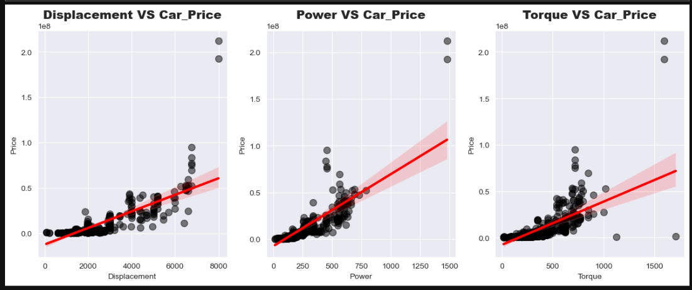
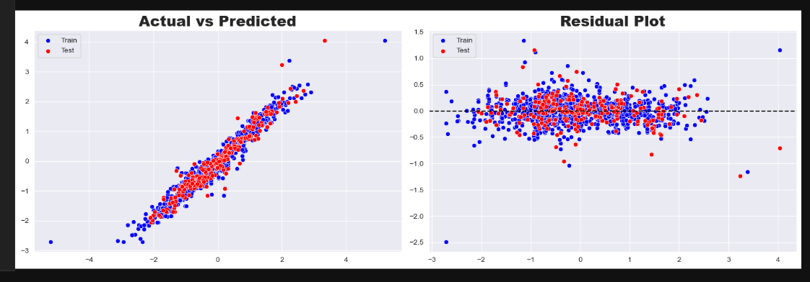

<p align="center">
  
</p>

<p align="center">
Predicting car ex-showroom prices using Machine Learning and 140+ vehicle features.
</p>


## 📌 Project Overview

This project aims to build a Machine Learning model that accurately predicts the **ex-showroom price of cars** using a dataset containing more than **140 vehicle attributes**. The dataset includes various specifications such as engine performance, fuel type, transmission, dimensions, safety features, and other technical characteristics that influence a vehicle's market value.

The project follows a complete end-to-end Data Science workflow, covering data preprocessing, exploratory data analysis, feature engineering, statistical analysis, transformation, encoding, and model building.

---

## 🎯 Business Objective

Determining the right price for a vehicle is one of the most important decisions in the automotive industry. Accurate price estimation helps:

* Automotive manufacturers optimize pricing strategies.
* Dealers evaluate vehicle value effectively.
* Buyers make informed purchasing decisions.
* Sellers understand the factors influencing vehicle prices.

By leveraging machine learning techniques, this project provides a data-driven approach to predicting car prices based on their specifications.

---

## 📊 Dataset Information

* **Dataset:** Ex-Showroom Car Price Dataset
* **Target Variable:** Price
* **Features:** 140+ vehicle attributes
* **Problem Type:** Regression

---

## 🔍 Project Workflow

### 🧹 Data Cleaning

* Handled missing values.
* Removed duplicate records.
* Corrected inconsistent data formats.
* Optimized data types for analysis.

### 📈 Exploratory Data Analysis (EDA)

* Univariate Analysis
* Bivariate Analysis
* Multivariate Analysis
* Outlier Detection
* Target Variable Distribution Analysis
* Feature Relationship Analysis
<p align="center">
  
</p>

<p align="center">

  

### ⚙️ Feature Engineering

* Created meaningful feature groups.
* Removed redundant features.
* Improved feature representation.
* Prepared data for machine learning models.

### 📊 Statistical Analysis

* Pearson Correlation Analysis
* Spearman Correlation Analysis
* Multicollinearity Detection
* Feature Importance Assessment
<p align="center">
  
</p>

<p align="center">

### 🔄 Data Transformation

* Log Transformation
* Square Root Transformation
* Box-Cox Transformation
* Skewness Reduction Techniques

### 🔤 Categorical Feature Encoding

* One-Hot Encoding
* Label Encoding
* Frequency Encoding
* Target-Based Encoding

### 📏 Feature Scaling

* StandardScaler
* Numerical Feature Standardization

### 🤖 Model Building

Multiple machine learning regression models were trained and evaluated:

* Linear Regression
* Ridge Regression
* Lasso Regression
* ElasticNet Regression
* Tree-Based Models
* Ensemble Models

### 🎯 Hyperparameter Tuning

* GridSearchCV
* Cross Validation
* Model Optimization

---

## 📉 Model Evaluation Metrics

The models were evaluated using:

* R² Score
* Adjusted R² Score
* MAE (Mean Absolute Error)
* MSE (Mean Squared Error)
* RMSE (Root Mean Squared Error)

---
<p align="center">
  
</p>

<p align="center">
  
## 🛠️ Technologies Used

* Python
* Pandas
* NumPy
* Matplotlib
* Seaborn
* SciPy
* Scikit-Learn

---

## 📂 Project Structure

```text
Car-Price-Prediction/
│
├── Data/
│   └── cars_data.csv
│
├── Images/
│   └── car_image.png
│
├── Python/
│   └── car_price_prediction.ipynb
│
└── README.md
```

---

## 🚀 Key Outcomes

* Built an end-to-end machine learning pipeline.
* Identified important factors affecting car prices.
* Applied statistical techniques for feature selection.
* Improved model performance through transformation and hyperparameter tuning.
* Generated accurate car price predictions using regression models.

---

## 👨‍💻 Author

Mohit Negi

If you found this project useful, feel free to ⭐ the repository.
